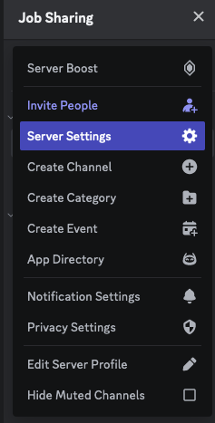
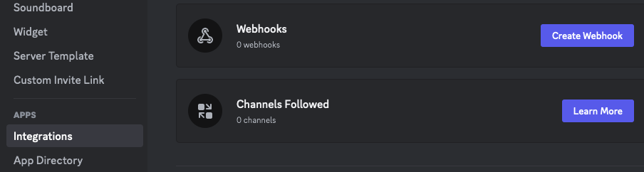
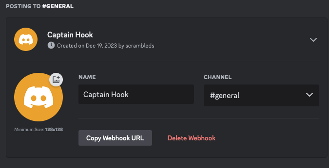

# Auction Fisher

A utility to notify you via discord webhook if any of the cards you have active bids or asks on are involved in an auction. Not intended to be easy to set up.

## Setup

1. Download the [Node.js](https://nodejs.org/en/download/current) matching your operating system.
2. When finished, [download the zip](https://codeload.github.com/Kractero/auction-observer/zip/refs/heads/main) and extract the file.
3. Enter the directory and run npm install.
4. Create a server and enter the settings.

5. Go to integrations and create a new webhook.

6. Copy the webhook url.
   

7. At line 5 of main.js, put in the webhook url, main nation (which will also act as the user agent) as well as the @ you want to be notified (here, your username, etc).
8. Schedule it with windows task scheduler or crontab or something to run like every 50 minutes.
